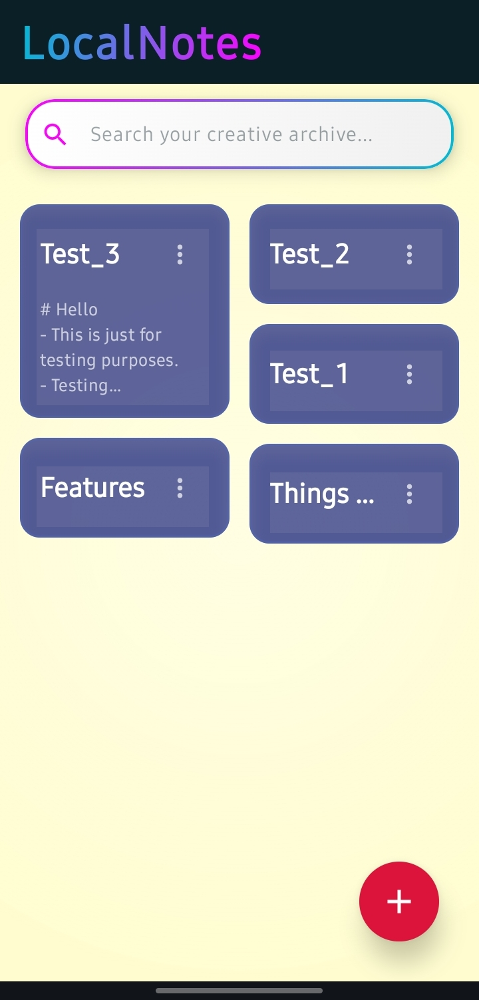
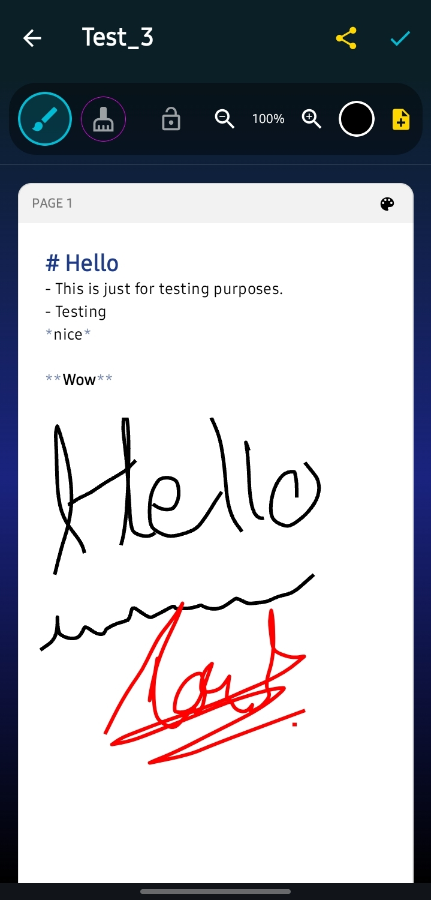

# LocalNotes

> A fast, local-first hybrid note-taking application for Android that seamlessly combines Markdown text editing with a freehand drawing canvas.

---

## Showcase

| Main Dashboard | Combined Markdown + Drawings |
| :---: | :---: |
|  |  |

---

## What is LocalNotes?

LocalNotes is an offline-first mobile app designed for seamless note-taking. It bridges the gap between structured text and visual sketching by letting you write raw Markdown while sketching, diagramming, or handwriting directly on top of the same page.

All data is kept strictly on your local device for maximum speed and privacy.

---

## How It Works

1. **Hybrid Canvas Rendering:** The workspace functions as an interactive canvas. You can type standard Markdown syntax (`# headers`, `**bold**`, bullet points) while overlaying vector strokes anywhere on the page[cite: 1].
2. **Inking & Canvas Controls:** Use the top toolbar to switch between pen input, precision eraser, canvas locking (to prevent stray marks while scrolling), and multi-page additions.
3. **Local File Management:** Notes are indexed and stored on device, providing rapid search filtering directly from the main grid dashboard.
4. **PDF Generation:** Documents, including both text and active ink layers, are compiled into vector-rendered PDF files for sharing or archiving[cite: 1].

---

## Sample PDF Export

You can review a full document generated directly from the app:

* **Export File:** [`LocalNotes_Export.pdf`](LocalNotes_Export.pdf)

---

## Technical Architecture & Deep Tech Stack

### 1. Core Architecture & Language
* **Kotlin:** 100% Kotlin codebase leveraging Coroutines and `StateFlow`/`SharedFlow` for asynchronous thread handling and reactive UI state management.
* **MVVM Architecture:** Strict separation of concerns between reactive UI states, canvas input event handlers, and offline local persistence layers.

### 2. UI & Custom Canvas Engineering
* **Jetpack Compose:** Modern Android UI framework handling dynamic layouts, dark theme styling, and state-driven UI updates.
* **Vector Drawing Engine:**
  * Built using `androidx.compose.foundation.Canvas` combined with low-level `android.graphics.Path` data models.
  * **Pointer Event Pipeline:** Uses `pointerInput` and `detectDragGestures` to sample stylus and touch inputs with minimal input latency.
  * **Precision Eraser:** Executes real-time path collision testing or offscreen compositing using `PorterDuff.Mode.CLEAR` / `BlendMode.Clear` to strip drawn paths cleanly.
  * **Coordinate Normalization:** Stroke points are stored as normalized vector coordinates so drawings remain pin-sharp across viewport scaling (`100%`, step zoom) and varying screen densities.

### 3. Markdown Parsing Engine
* **AnnotatedString Formatting:** Real-time text parser converting raw Markdown tokens (`#`, `**`, `*`, list identifiers) into Compose `AnnotatedString` instances with rich typography styling embedded inside the editing canvas.

### 4. Under the Hood: PDF Export Engineering
Instead of taking dirty bitmap screenshots of the screen, PDF export compiles a clean, vector-rendered document from scratch using native Android graphics pipelines:

1. **Document Setup:** Instantiates an `android.graphics.pdf.PdfDocument` instance.
2. **Multi-Page Allocation:** Iterates through document pages and configures `PdfDocument.PageInfo` targets matching target paper dimensions at high DPI.
3. **Canvas Surface Acquisition:** Calls `pdfDocument.startPage(pageInfo)` to receive a hardware-accelerated `android.graphics.Canvas` instance representing the PDF page surface.
4. **Text Layer Pass:** Formatted Markdown strings are rendered onto the PDF canvas using `android.text.TextPaint` and `android.text.StaticLayout` to guarantee exact line wrapping, typography scaling, and margin constraints.
5. **Vector Ink Replay Pass:** The engine iterates through the saved `Path` stroke array and re-draws every gesture line directly onto the PDF `Canvas` using custom `android.graphics.Paint` configurations (`Paint.Style.STROKE`, `Paint.Cap.ROUND`, `Paint.Join.ROUND`).
6. **Disk I/O & Native Sharing:**
   * Finalizes the page using `pdfDocument.finishPage()`.
   * Streams the raw binary payload to local device storage using `java.io.FileOutputStream`.
   * Wraps the local output file in an Android `FileProvider` (`androidx.core.content.FileProvider`) URI for instant, zero-copy sharing to external apps.

### 5. Storage & Local Persistence
* **Offline Storage:** Raw note data (Markdown content and serialized coordinate arrays for vector ink paths) is saved locally via Android File System APIs and internal app storage without cloud dependencies.

---

## License

This project is licensed under the MIT License. See the `LICENSE` file for details.
